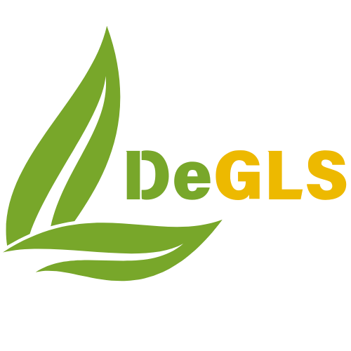
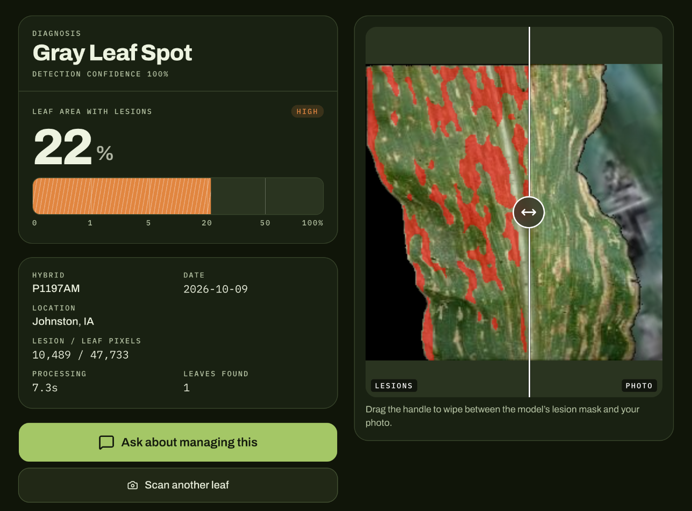
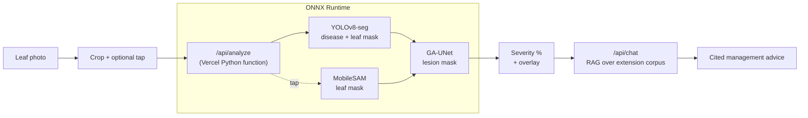

<p align="center">
  
</p>

<h1 align="center">DeGLS</h1>

<p align="center">
  <em>Photograph a corn leaf. Get the disease, how much of the leaf it has taken, and what to do about it.</em>
</p>

<p align="center">
  <a href="https://github.com/unio207/DeGLS/actions/workflows/ci.yml"></a>
  <a href="https://degls.vercel.app"></a>
  <a href="LICENSE"></a>
  
  
  
</p>

<p align="center">
  <b><a href="https://degls.vercel.app">Live demo</a></b> ·
  <b><a href="https://youtu.be/dPj_7HmI-1g">Video</a></b> ·
  <b><a href="https://isef.net/project/soft047-deep-learning-detection-system-for-gray-leaf-spot">ISEF project page</a></b>
</p>

---

**DeGLS** (Detection of Gray Leaf Spot) is a field tool for corn growers and agronomists. From a single phone photo of a leaf it identifies **gray leaf spot**, **northern corn leaf blight** or **common rust**, segments every lesion, and reports the percentage of the blade that is diseased — the number that actually drives a fungicide decision. A built-in assistant then answers "what do I do about this?" with citations to university extension publications.

The project was a finalist at the Regeneron International Science and Engineering Fair (ISEF 2025, Systems Software, SOFT047).

<p align="center">
  
</p>

## Demo

<p align="center">
  <a href="https://youtu.be/dPj_7HmI-1g">
    
  </a>
  <br>
  <sub>Two-minute project video from ISEF 2025 — click to watch on YouTube.</sub>
</p>

## Features

- **Disease identification** — a YOLOv8 segmentation model detects the leaf and classifies it as gray leaf spot, northern leaf blight or common rust.
- **Severity as a number** — a GA-UNet lesion segmenter measures lesion pixels against leaf pixels, placed on the standard 0–1–5–20–50–100% severity scale.
- **Tap-to-select leaf** — the user taps the leaf to measure; with MobileSAM enabled (`DEGLS_SAM=1`) that tap prompts the leaf mask, so the reading covers the leaf you meant, not the one behind it.
- **Crop before scanning** — exclude soil, hands and background before anything is measured.
- **Guards against confident nonsense** — a leaf-plausibility check rejects photos that aren't corn leaves, and a chlorosis guard withholds severe readings on uniformly yellowed tissue that the segmenter tends to over-count.
- **Management assistant** — retrieval-augmented chat over 23 university extension and Crop Protection Network publications in [`corpus/`](corpus/), so answers cite a real source. (The committed index is empty until it is built with `scripts/ingest_corpus.py`; without it the assistant answers from the diagnosis alone and says so.)
- **Scan history and map** — past scans, with hybrid, location and date, are kept on-device (IndexedDB) and plotted on an OpenStreetMap map.
- **Installable PWA** — laid out for phones and iPads in the field.

## How it works



1. The browser crops and downscales the photo, then posts it to a **stateless Python function**. Nothing is written to disk; the overlay comes back as a data URI.
2. **YOLOv8-seg** finds the leaf and names the disease. With SAM enabled, **MobileSAM**, prompted at the user's tap, provides the leaf mask instead.
3. **GA-UNet** segments lesions on the isolated leaf at 512×512. Severity is lesion pixels ÷ leaf pixels.
4. The diagnosis is passed to the **chat route**, which embeds the question, retrieves the closest passages from `data/embeddings.json` by cosine similarity, and streams an answer that cites them.

All three models were trained in PyTorch and exported to ONNX ([`scripts/export_onnx.py`](scripts/export_onnx.py)), so the deployed function runs on `onnxruntime` + `opencv-headless` with no torch — about 343 MB installed, inside Vercel's 500 MB function limit. [`scripts/verify_parity.py`](scripts/verify_parity.py) checks the ONNX path against the original PyTorch models on every fixture.

## Tech stack

| Layer | Technology |
|---|---|
| Frontend | Next.js 16 (App Router), React 19, TypeScript, Tailwind CSS 4, shadcn/ui, Leaflet |
| Inference | Python 3.12 serverless function, ONNX Runtime, OpenCV, NumPy |
| Models | YOLOv8s-seg (disease + leaf), GA-UNet (lesions), MobileSAM (tap-prompted leaf mask) |
| Assistant | Vercel AI SDK, OpenAI chat + `text-embedding-3-small`, in-memory vector search |
| Hosting | Vercel |

## Project structure

```
.
├── app/                 Next.js routes — the scan page and /api/chat
├── components/
│   ├── scan/            capture, crop, results, history and map
│   ├── chat/            management assistant UI
│   └── ui/              shadcn/ui primitives
├── lib/                 RAG retrieval, on-device history, shared types
├── api/                 /api/analyze — Python inference function
├── models/              ONNX weights (YOLO, GA-UNet, MobileSAM)
├── corpus/              extension publications behind the assistant
├── data/                prebuilt embedding index
├── scripts/             ONNX export, parity check, corpus ingest, smoke tests
├── tests/fixtures/      sample leaf photos
└── legacy/              the original 2025 Flask version
```

## Getting started

**Requirements:** Node.js 20+, Python 3.12, and the [Vercel CLI](https://vercel.com/docs/cli) to run the Python function locally.

```bash
git clone https://github.com/unio207/DeGLS.git
cd DeGLS
npm install
```

Create `.env.local` with an OpenAI key for the assistant (the scanner works without it):

```bash
OPENAI_API_KEY=sk-...
```

Run the full stack — Next.js and the Python function — with:

```bash
npx vercel dev
```

Or run only the frontend with `npm run dev` and append `?mock=gls` (also `nlb`, `rust`, `severe`, `no_leaf`, …) to the URL to render a result state without the Python function. Mock mode is disabled in production builds.

### Useful scripts

```bash
npm run lint                                  # ESLint
python scripts/smoke_api.py                   # end-to-end test of /api/analyze
python scripts/ingest_corpus.py               # rebuild data/embeddings.json from corpus/
python scripts/threshold_sweep.py             # contact sheet of lesion masks by threshold
```

The inference function is tuned through `DEGLS_*` environment variables (lesion threshold, SAM on/off, plausibility and severity guards); each is documented where it is read in [`api/analyze.py`](api/analyze.py).

## Background

The first version of DeGLS (in [`legacy/`](legacy/)) was a Flask app running PyTorch and Ultralytics on a server. This repository is a rebuild for real field use: serverless ONNX inference, a mobile-first interface, input guards, and a self-hosted RAG assistant in place of a third-party chatbot.

## License

[MIT](LICENSE) © Henry Zou

The MIT license covers the code. Documents in `corpus/` remain the work of their original publishers (public university extension material, redistributed with attribution); see [`corpus/README.md`](corpus/README.md).
